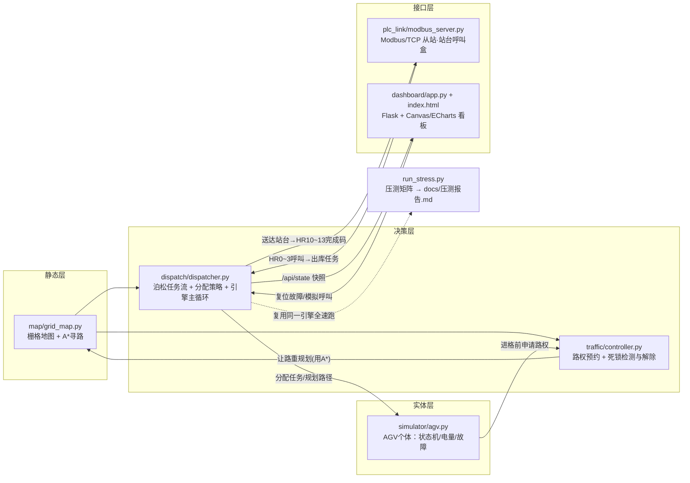

# 多 AGV 调度与交通管制仿真 · 系统设计说明书

> 本文档面向评审者与面试官，解释系统的架构决策、核心算法实现细节，
> 以及"为什么这么设计"。所有性能数字均为**仿真验证值**（口径见文末）。

---

## 1. 系统架构

### 1.1 模块拓扑



### 1.2 单帧（tick = 0.2s）处理顺序

引擎 `SimulationEngine.tick()` 严格按以下顺序推进（先需求、再决策、再执行、再管制、后统计）：

1. **泊松到达**：`Dispatcher.maybe_spawn()` 检查指数分布的下一到达时刻；
   同时消费 Modbus 呼叫队列（HRk=1 → 出库任务）；
2. **任务分配**：对每个待分配任务执行"最近空闲车优先"策略 + A* 规划去程；
3. **车辆步进**：每台 AGV `step()`——预约路权 → 插值移动 → 进格结算（电量/里程）
   → 取放货停留计时 / 充电 / 故障判定；
4. **交通管制**：`TrafficController.tick()` 周期性在等待图中找环并仲裁让路；
5. **受阻重规划 + 让位请求**：被堵超过门限的车先尝试绕行；挡路者是空闲停靠车时
   下发"挪车让位"指令；
6. **指标采样**：吞吐曲线（5s）、响应时间滑动均值（30s）、队列峰值。

线程模型：引擎独占一个线程；Flask 与 Modbus 各自线程只通过
`snapshot()`（加锁拷贝）与寄存器桥接队列交互；Flask 的全部 POST 控制接口
（暂停/故障复位/站台呼叫）统一持 `engine.lock` 进入，与引擎 tick 互斥，
外部线程不绕锁直改仿真内部状态。

---

## 2. 地图与 A* 寻路（map/grid_map.py）

### 2.1 地图数据模型

- 30×20 栅格 JSON：`#`=货架墙（不可通行），`.`=巷道；
- 特殊格：4 个出入库站台（ST1~ST4，对应 Modbus HR0~3）、2 个充电站；
- **单向巷道语义**（易错点，面试加分项）：方向约束只作用于**沿巷道轴向**的通行。
  东西向单行格允许"正向通过"和"南北垂直穿越"两种移动——否则十字路口会把
  垂直穿越误判为违规，车辆驶入货架间的纵向通道后永远出不来（陷阱格）。
  本项目调试期真实踩过这个坑：修复前 1.5 万次送货规划失败全部源于此；
- 货位点（slot）：与货架正交相邻的巷道格，共 214 个，作为任务取放坐标池。

### 2.2 A* 实现

```python
f(n) = g(n) + h(n)      # g: 已走步数; h: 曼哈顿距离 |dx|+|dy|
```

- 开放列表用最小堆 `(f, seq, node)`，seq 保证同 f 时 FIFO，结果确定可复现；
- 三色标记 + closed 集，弹出终点即回溯 `came_from` 得到格子序列；
- **可采纳性**：四邻接、每步代价 1 时曼哈顿距离绝不高估 ⇒ A* 结果最优；
- **动态避障接口**：`find_path(start, goal, blocked)` 的 `blocked` 是"其他车占用/
  预约格"集合，调度与让路重规划共用同一条路径算法；
- 终点豁免：goal 即使被占也不算 blocked——否则有人下货的站台永远不可达。

### 2.3 A* 与 Dijkstra 的区别（高频考点）

| 维度 | Dijkstra | A* |
|---|---|---|
| 扩展依据 | 只按 g（过去代价） | g + h（引入目标导向） |
| 展开范围 | 以起点为圆心全向扩散 | 朝目标方向的锥形区域 |
| 最优性 | 最优 | h 可采纳时最优 |
| 适用场景 | 多目标/无目标 | 单目标点对点（本项目场景） |

本项目 30×20=600 格的小图上两者都够快，但 A* 的"启发式剪枝"思想是
大规模路网（真实仓库上万格）下唯一现实的选择，因此从第一天就按 A* 设计。

---

## 3. 交通管制（traffic/controller.py，项目灵魂）

### 3.1 路权模型：两张表 + 一条铁律

```
cell_owner[cell]   = agv_id     # 当前占用表：一格一车的"一"
reservations[cell] = agv_id     # 进格预约表：每格至多一个预约者
```

铁律：**进入任何格子之前必须持有该格的路权**。`request_cell()` 的授权条件是
"目标格既无他人占用也无他人预约"，因此两车同时获准进入同一格在机制上不可能
发生——防对撞不是统计出来的好运气，而是不变式（invariant）保证。
并且这条不变式是**被运行时测量的**：引擎每拍执行 `check_invariants()`
（两车同格 / 占格无主 / 幽灵占用预约记录，任一违反即计入
`invariant_violations` 并 fail-fast），压测全程违规计数为 0。

**纵深软预约**（RESERVATION_DEPTH=3）：获得下一格授权后，再尝试"软预约"
前方 2 格，提前向全网暴露行驶意图，减少路口对峙。软预约失败不记等待边
（车并未真正受阻）；真正的裁决发生在进格那一刻的硬申请上。

### 3.2 死锁检测：等待图找环

- **建图**：每 0.4s 依据当前路权表重建等待图。边 a→b 表示
  "a 的下一步被 b 挡住"。空闲停靠车没有待执行路径、没有出边，不参与建图
  （它们由 §3.4 的让位机制处理）；
- **找环**：DFS 三色标记法（白/灰/黑），遇到指向灰点的回边即存在有向环，
  回溯 parent 链得到环成员序列；
- **判定意义**：环 ⇔ 一组车互相等待无人能动 ⇔ 死锁成立。

### 3.3 死锁解除：破坏"循环等待"

死锁四必要条件在本系统中的对应与利用：

| 必要条件 | 系统中的体现 | 解除策略如何破坏它 |
|---|---|---|
| 互斥 | 格子路权独占（业务必须保留） | 不破坏——安全底线 |
| 占有且等待 | 持脚下格、等下一格 | 让路者释放全部预约（放弃"等待"的一半） |
| 不可抢占 | 预约不能被第三方强行剥夺 | 让路者**自愿**交出预约，等价于协商式抢占 |
| 循环等待 | 等待图中的有向环 | 重规划改变让路者的等待对象，环被打断 |

仲裁流程（每次检出一条环）：

1. **冷却期**：同一批成员的环 3s 内不重复仲裁，防止计数刷屏与 CPU 空转；
2. **计数口径（按环去重）**：以 `frozenset(环成员)` 维护"活跃死锁集合"——
   环首次检出才计 1 起"物理死锁"（deadlock_detected），同一环冷却期后
   重复仲裁只累计"仲裁触发次数"（arbitration_total）；环从活跃集合消失
   （让路生效或阻挡者腾位）才计 1 次"消除"（deadlock_resolved）；
3. **选让路者**：剩余路径最长者优先（离目标最远、绕行代价最小），且优先选
   "目标格未被堵"的候选——目标恰为被堵格的车重规划会因 A* 终点豁免而
   "假成功"，指派它让路无法破环（复审06 N1 根治）；反复失败则轮换游标换人，
   避免永远盯死同一辆造成活锁；
4. **渐进松弛重规划**：
   第 1 次避开他车占用+预约格（严格）；第 2 次只避实际占用格（宽松——
   借道别人的预约格是安全的，因为真正进格还要过硬性路权审查）；
5. **有效性判据与升级（复审06 N1 根治）**：重规划"成功"必须以"装载后
   下一步即能获得路权"为准——新路径首格仍被其他车占/预约（典型：让路者的
   goal 恰为互等方脚下格，终点豁免使重规划恒返回同一条直达路径）不得直接
   装载，升级为"先侧避空格、再回原目标"的改道（dodge_detours 计数；
   受阻绕行对这类假成功路径同样不再装载，只累计连续重规划上限）；
6. **不可解环**：侧避也无解（或 goal 即脚下的退化无目标情形）⇒ 原地等待
   并计数上报（unresolved_waits，按环首次判定至多计 1 次，事件日志显著
   告警），等待阻挡格局自行瓦解；压测报告只在 unresolved==0 时才允许
   输出"全部环已消解"的结论。

### 3.4 两类非环拥堵的配套机制

- **受阻绕行**：单车被堵超过 REROUTE_WAIT_LIMIT(1.5s)，自动重规划（同样渐进松弛）；
  同一车连续 3 次即停手交给死锁仲裁，防止抖动；
- **让位指令（dodge）**：若阻挡者是"空闲停靠车"——它不在等待图里，环检测天然失明——
  引擎按 BFS 由近及远在 ≤6 步半径内搜索无人占/无预约的可站之格，找到即规划
  挪车路径让它挪窝（并同步其行程终点，防止被仲裁后按过期目标折返）。这是压测中
  "收尾阶段队列清空却有个别车永久互等"问题的根治手段。

---

## 4. 任务分配（dispatch/dispatcher.py）

### 4.1 为什么先做"最近空闲车优先"？

1. **目标匹配**：空载行驶率 ≈ 空驶接单距离占比。最近优先直接最小化接单距离，
   在本压测中把空载行驶率压到 ~49%（含送货段归零后的返程空驶）；
2. **复杂度友好**：n 台车 × m 个候选任务，O(n·m) 次 A* 即可完成一轮分配，
   5ms 内结束，不需要额外的通信轮次；
3. **工程务实**：拍卖法需要多轮"招标-报价-落槌"通信协议与更复杂的仲裁，
   在单进程仿真里收益有限、复杂度显著。先用最近优先把**交通管制**这个真难点
   做扎实，是优先级排序的正确选择；
4. **架构留门**：`AssignmentStrategy.select(task, idle_agvs, engine)` 是唯一
   策略入口，`AuctionStrategy` 已给出合同网协议的实现骨架（出价函数 =
   行驶代价 - 电量折扣 - 负载均衡折扣），二期填充即可切换。

### 4.2 拥堵治理的两个补充规则

- **分配距离上限**（ASSIGN_MAX_DIST=42 步）：超远单先压在队列里，避免车辆
  长途横穿全场织出交叉冲突网；任务等待超过 240s 自动老化放行，杜绝饥饿；
- **泊松突发注单**：压测 λ=0.6/s 时 200 个任务约 330s 内全部到达，
  刻意制造排队压力来暴露交通管制的缺陷（这正是压测的目的）。

---

## 5. Modbus/TCP 站台呼叫盒（plc_link）

- 从站：pymodbus 3.6 异步服务端跑在独立线程的事件循环里；
  HR0~3 呼叫（写 1 消费生成出库任务）、HR10~13 完成码（送达置 1，
  客户端读后回写 0 应答）、HR20 心跳（秒增，监控存活）；
- 寻址：`ModbusSlaveContext(zero_mode=True)` 保持 0 基地址，客户端地址与
  数据块下标一一对应（已通过自测脚本验证）；
- 线程安全：寄存器只在从站循环线程内读写；引擎侧经 `deque + 
  call_soon_threadsafe` 跨线程投递，业务层完全不接触异步细节；
- 自测闭环：`modbus_client_test.py` 验证 心跳增量 ×2 + 四站台
  呼叫→完成码点亮→应答回写 全流程（实测 PASS）。

---

## 6. Web 看板（dashboard）

- 后端仅两个职责：`GET /api/state` 返回加锁快照；`POST` 动作
  （暂停 / 复位故障 / 模拟站台呼叫——后者走真实 HRk=1 寄存器链路）；
- 前端原生 Canvas：货架/巷道/站台/充电站底图 + AGV 圆形本体（状态着色）
  + 电量外环 + 受阻脉冲红圈 + 点选高亮剩余路径；显示坐标做指数平滑插值，
  500ms 快照间隔下动画依然连贯；
- ECharts(CDN)：吞吐累计曲线、平均响应时间曲线、车队电量横向柱图；
  任务队列表与彩色事件日志（到达/分配/完成/让路/死锁/回充/故障）。

---

## 7. 性能口径声明（重要）

本文与 README、简历中出现的全部数字均为**仿真验证值**：

- 环境：30×20 栅格、214 货位、Δt=0.2s 离散步进、固定随机种子 20240601；
- 压测口径：200 个任务以泊松 λ=0.6/s 突发注单（约 330s 注完），FIFO 处理，
  测量的是**饱和排队下的消化能力**；因此"平均任务响应时间"包含大量排队时间
  （3 车 1276s → 8 车 455s），它反映的是吞吐-排队的守恒关系而非派单延迟；
  日常演示模式（λ=0.3、5 车）下任务基本即到即派，看板上响应时间为亚秒级；
- 结论数字见《docs/压测报告.md》对比表：吞吐 4.11 / 6.27 / 9.02 个/min，
  物理死锁（按环去重）30 / 57 / 79 起且全部消除，全程占格冲突 0
  （该值由引擎每拍"一格一车"不变式断言实测，违规即 fail-fast，非设计推断）。

## 8. 边界与设计决策披露

### 8.1 规格未尽事项的自定口径（主动披露，答辩防线）

规格未细化、由本项目自定并保持一致的口径：

1. **故障率 1% 的判定单位**：按"每完成一次搬运任务"掷一次骰子（规格只给
   概率未给单位）；复位方式有两种——看板模式为纯人工按钮复位（`POST
   /api/agv/<id>/reset`），压测模式用 60 仿真秒等效自动复位以不阻塞长测，
   两种模式均在 config 可切换语义。
2. **低电回充的触发时机**：仅在"空闲"或"任务完成后"评估 <20%；行驶中电量
   跌破阈值不打断当前任务（避免半途弃货）。代价是短场景可能全程不触发——
   压测中 8 车场景零触发即属此类，并非缺陷。
3. **"低优先级车"的定义**：死锁环内剩余路径最长者优先让路（离目标最远、
   绕行代价相对最小）；反复失败时按轮换游标换人仲裁，防止活锁。
4. **拥堵治理参数**：分配距离上限 42 步、任务老化放行 240s、纵深软预约
   DEPTH=3，均为压测调优得出的工程参数，非规格要求。

### 8.2 未覆盖范围

未覆盖（诚实声明）：SLAM 定位、底盘运动控制、路径跟踪、电池真实模型、
多深库位货箱管理、跨楼层电梯对接。改进路线：时间窗路径规划（CBS 冲突搜索）→
道口红绿灯分组放行 → 拍卖法分配上线 → 库位热力均衡。
